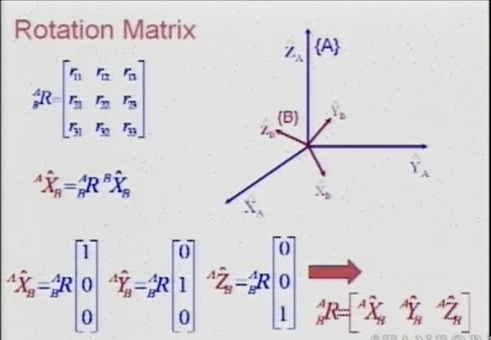
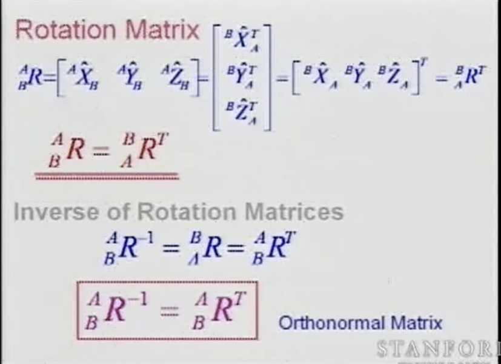

# Robotics Lecutre 2

## Key Idea
Explains the role of software between the robots and humans.
Humans think in Cartesian space. (Reach the door knob and turn it)
Robots are built in Joint space. (bend elbow 30°, rotate shoulder 10°)
Software connects the two.

## Key Concepts
1. Techanical Terms
  - Base, End-effector
  - Revolute joint - 1 DOF (joint only allows rotational motion)
  - Prismatic joint - 1 DOF (joint only allows translational motion)
  - Spherical joint - 3 DOF
  - Configuration parameters - a set of position parameters that describes the full configuration of the system
  - Generalized coordinates - a set of independent configuration parameters
  - Degree of freedom - number of generalized coordinates

2. DOFs
  - One rigid body needs 6 parameters to define its position (3 positions, 3 orientations)
  - Joint introduces 5 constraints to a rigid body -> 1 DOF
  - A robotic arm with multiple links have n DOFs where n is equal to the number of joints. ( 5 joints -> 5 DOFs)

3. End-Effector
  - Joint coordinates -> joint space
  - Cartisan coordinates -> operational space
  - Redundancy -> when the DOF of robot(n) is greater than DOFs of end-effector(m)
  - Degrees of Redundancy = n-m (not discussed)

4. Rigid body configuration
  - Orientation matrix - 1x3 matrix
  - Rotation matrix - 3x3 matrix
    
    
     
    

## Connection to Robots

## Confusing parts

