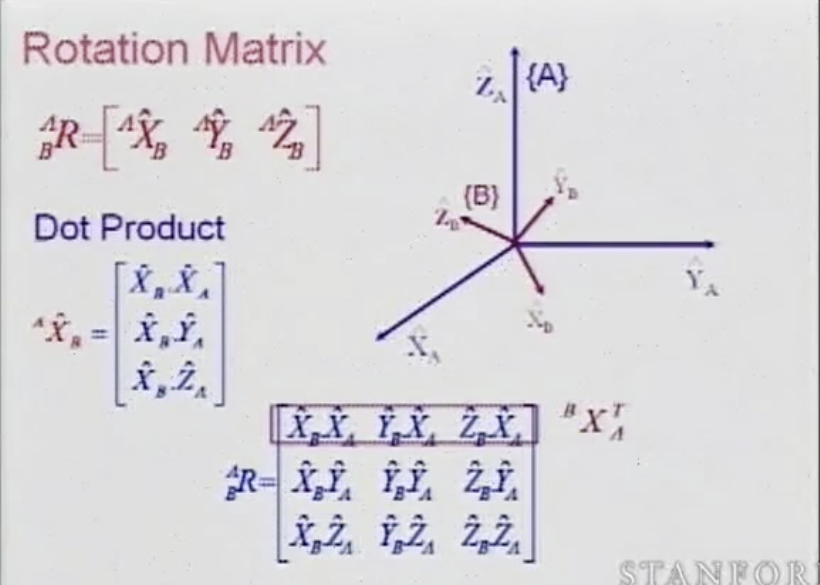
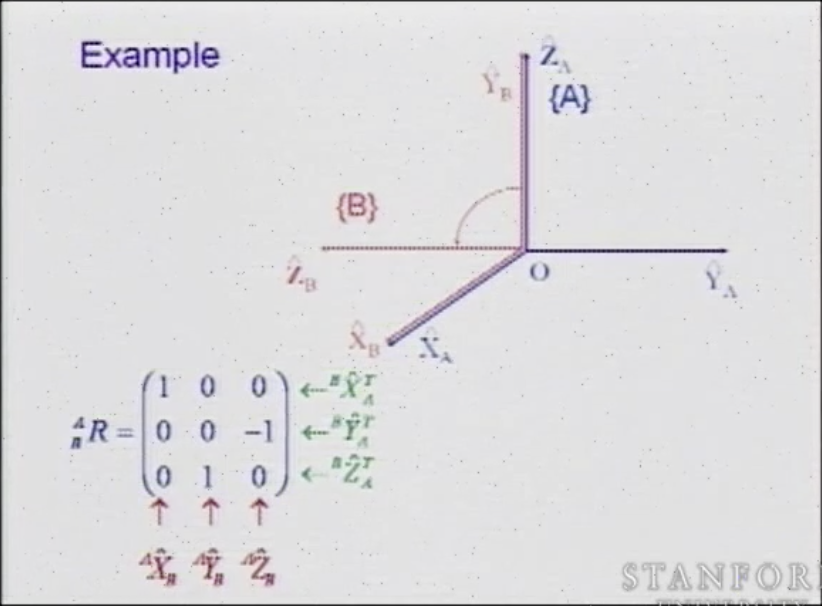
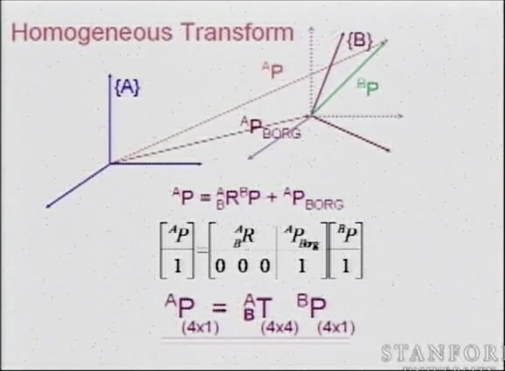
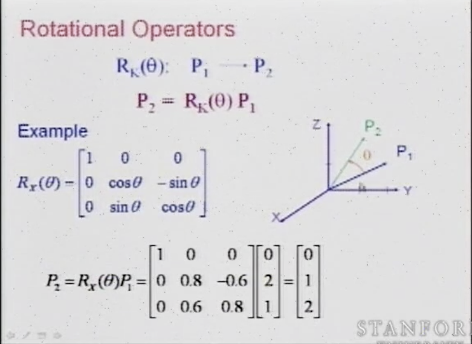
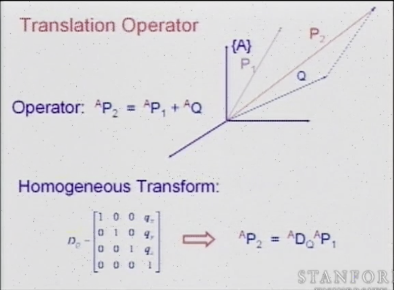
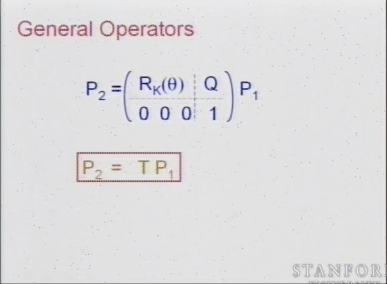
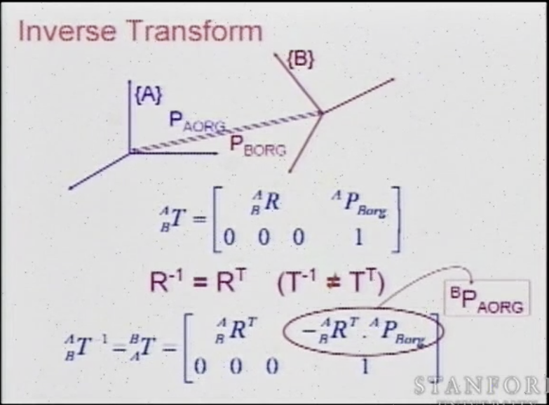

# Robotics Lecutre 2

## Key Idea
Explains the role of software between the robots and humans.
Humans think in Cartesian space. (Reach the door knob and turn it)
Robots are built in Joint space. (bend elbow 30°, rotate shoulder 10°)
Software connects the two.

## Key Concepts
1. Techanical Terms
  - Base, End-effector
  - Revolute joint - 1 DOF (joint only allows rotational motion)
  - Prismatic joint - 1 DOF (joint only allows translational motion)
  - Spherical joint - 3 DOF
  - Configuration parameters - a set of position parameters that describes the full configuration of the system
  - Generalized coordinates - a set of independent configuration parameters
  - Degree of freedom - number of generalized coordinates

2. DOFs
  - One rigid body needs 6 parameters to define its position (3 positions, 3 orientations)
  - Joint introduces 5 constraints to a rigid body -> 1 DOF
  - A robotic arm with multiple links have n DOFs where n is equal to the number of joints. ( 5 joints -> 5 DOFs)

3. End-Effector
  - Joint coordinates -> joint space
  - Cartisan coordinates -> operational space
  - Redundancy -> when the DOF of robot(n) is greater than DOFs of end-effector(m)
  - Degrees of Redundancy = n-m (not discussed)

4. Rigid body configuration
  - Orientation matrix - 1x3 matrix
  - Rotation matrix - 3x3 matrix
  - Orthonormal matrix - transpose matrix (4x1) -> (1x4)  
    
    
     
    

5. Homogenous Transform
  - Rotation & Translation matrix * Original position (2nd equation in pic)
  - General transform - Rotational matrix + Translational matrix (1st equation in pic)
  - General -> Homogenous transform (using 4x4 matrix)
    
 
6. Forward Kinematics
  - see pics for Translation & Rotational operators
    - General operator = Translational + Rotational operators
    - Forward Kinematics = General operator
    
    
    

7. Inverse Kinematics
  - not the transpose of general operator
    

## Connection to Robots
  - Forward kinematics formula derivation
  - Each rigid object has six essentail parameters to describe its configuration (3 positions + 3 rotations)
  - Not important 
	- Mapping view - The point is fixed, the frame moves
	- Operator view - The frame is fixed, the point translates and rotates
  - Forward kinematics is the 4x4 matrix = (rotational matrix and translation matrix) * initial posistion
  

## Confusing parts
  - Relation between mapping view and operator view
  - Can't remember the forward kinematics formula and inverse kinematics 

